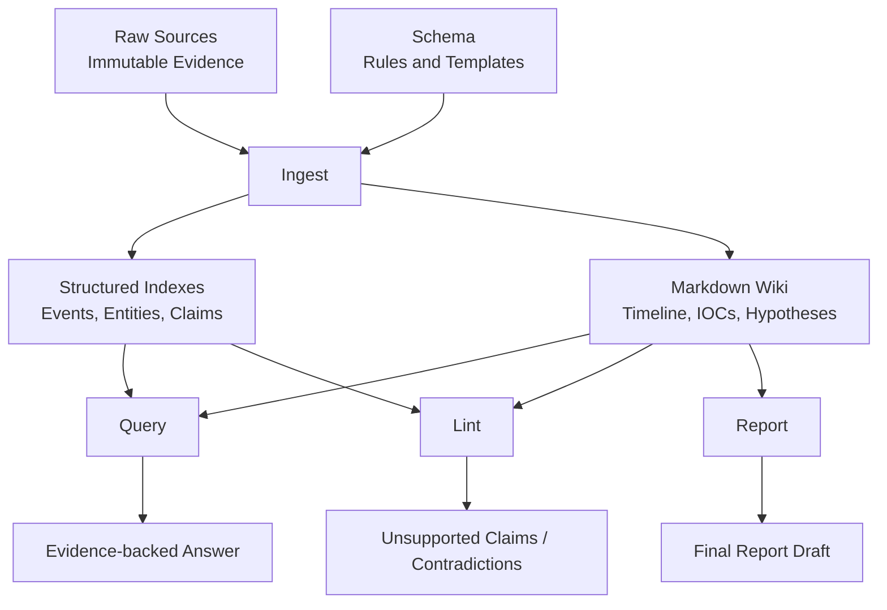

# Architecture

The Forensic LLM Wiki has exactly three on-disk layers and four CLI verbs.
Everything else is bookkeeping.

## System overview



## The three layers

### Layer 1 — `raw_sources/`

Immutable forensic evidence. The LLM may read these files; it may never
modify them. Each case lives under `raw_sources/<case_id>/`. Phase 3
introduced step subdirectories (`step_NN_*`) for cases whose evidence
arrives in waves.

The investigator (or the upstream pipeline that ships evidence into the
project) owns this layer. Everything downstream cites back into it.

### Layer 2 — `wiki/`

The compiled, evolving understanding of the case. **Markdown is the
product.** Every page is human-readable, Obsidian-compatible, and
re-rendered from a structured snapshot on every ingest, so the rendered
markdown and the structured state cannot drift.

```
wiki/cases/<case_id>/
  index.md, timeline.md, entities.md, iocs.md,
  hypotheses.md, contradictions.md, open_questions.md, final_report.md
  .fw/
    state.json                   # internal merge state
    manifest.json                # per-source bookkeeping
    events.json                  # structured index, stable evt_NNNN IDs
    entities.json                # structured index, stable ent_NNNN IDs
    claims.json                  # structured index, stable claim_NNNN IDs
    hypothesis_history.json      # per-step confidence trajectory
    traces.jsonl                 # per-operation traces
    ingestion_log.jsonl          # per-ingest summary
```

The `.fw/` sidecar carries machine-readable views of the same content so
query, lint, eval, and benchmark can reason without re-parsing markdown.

### Layer 3 — `schema/`

The wiki's own constitution. Defines the required pages, page templates,
citation rules, lint rules, and ingest/query/lint workflows. Both humans
and the LLM read it; both can evolve it.

## The four verbs

### `ingest`

1. Walk `raw_sources/<case>/` recursively.
2. For each file: skip-if-unchanged via the manifest hash; otherwise
   call the LLM (or the deterministic mock) to extract entities, events,
   IOCs, hypotheses, and contradictions.
3. Merge into the wiki state. Hypotheses dedup by title and take the
   stronger confidence; contradictions dedup by title; events dedup by
   `(timestamp, description, source)`.
4. Run a second pass for contradiction detection so order-independent
   conflicts (e.g. AV-clean vs. persistence) always land.
5. Assign stable IDs to anything new (`evt_NNNN`, `ent_NNNN`, `claim_NNNN`).
6. Render every page from state, write the structured indexes, append a
   trace, update the manifest.

`--dry-run` runs steps 1-5 in memory and prints unified page diffs without
touching disk. `--force` skips the manifest dedup. `--changed-only` is
the explicit form of the default behaviour.

### `query`

Three providers in order:

1. **Compiled wiki / structured indexes** — the answer composes claims,
   events, and IOCs into an `Answer / Assessment / Evidence /
   Contradictions / Confidence / Sources` layout.
2. **Raw-source lexical fallback** — only fires if the wiki has no
   compiled view of the topic. The answer is tagged
   `fell_back_to_raw_sources=True` and includes a visible note.
3. **Insufficient** — the literal sentence
   `The wiki does not contain enough evidence to support that claim.` —
   returned when even fallback finds nothing.

The query never hallucinates. The cost of `query` is reading one JSON
file; the marginal cost of additional questions is zero.

### `lint`

Four severity tiers. Every rule is text- or state-based; nothing calls
the LLM. Critical rules cover "confirmed malware" overclaims, final-report
overreach, and broken raw-source citations. High rules cover never-ingested
raw sources and high-confidence-but-weak-evidence claims. Medium rules
cover missing citations, broken wiki links, and contradiction drift.
Low rules cover duplicates, orphan pages/entities, and missing IOC
cross-references. `--json` emits the same findings for machine consumers.

### `report`

Composes `final_report.md` from the structured state. Preserves the
facts / inferences / hypotheses split and never promotes a hypothesis
above its actual confidence.

## Why markdown is the main knowledge layer

Three pragmatic reasons:

- **Auditability.** A reviewer can `cat hypotheses.md` and see exactly
  what the wiki believes and why. No special viewer.
- **Tooling.** Obsidian, VS Code, ripgrep, GitHub all render markdown
  with wiki-links. The wiki is portable across every editor.
- **Diffability.** `git diff` on markdown is meaningful;
  `diff-snapshots` produces unified diffs a human can read.

The structured indexes (`.fw/*.json`) exist to make queries fast and lint
rigorous, **not** to replace markdown. Every fact in JSON is also rendered
in some markdown page with its `Source:` and `claim_NNNN` / `evt_NNNN`
ID.

## How snapshots prove case evolution

`fw.py evolve <case>` runs ingest one step at a time and copies
`wiki/cases/<case>/` into `wiki_snapshots/<case>/after_<step>/` after
each. Two consequences:

- **`diff-snapshots`** can produce a markdown diff between any two
  steps. The diff between step 02 (registry) and step 03 (clean
  Defender scan) is the literal moment the wiki softens its assessment.
- **`hypothesis_history.json`** records per-step confidence and
  supporting/contradicting counts per hypothesis, so a reader can see
  how a single claim's evidence base evolved.

The whole point is that knowledge **compounds**: the eval score climbs
monotonically across steps (2 → 2 → 5 → 8 → 11 → 16 of 16 on the
included case), and the wiki retains every prior conclusion while adding
the new contradictions.
